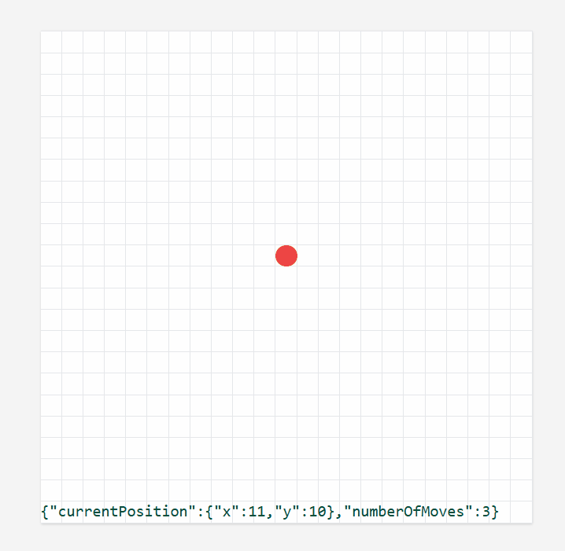
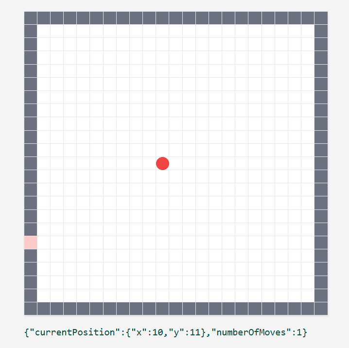
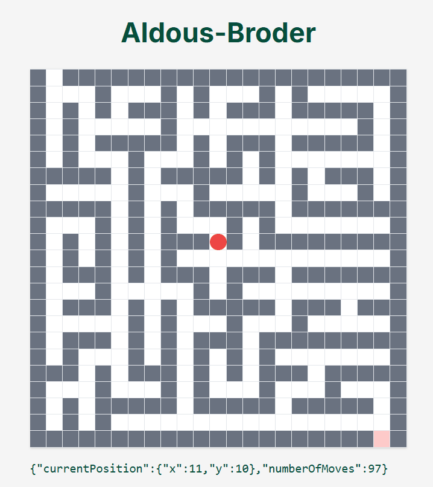
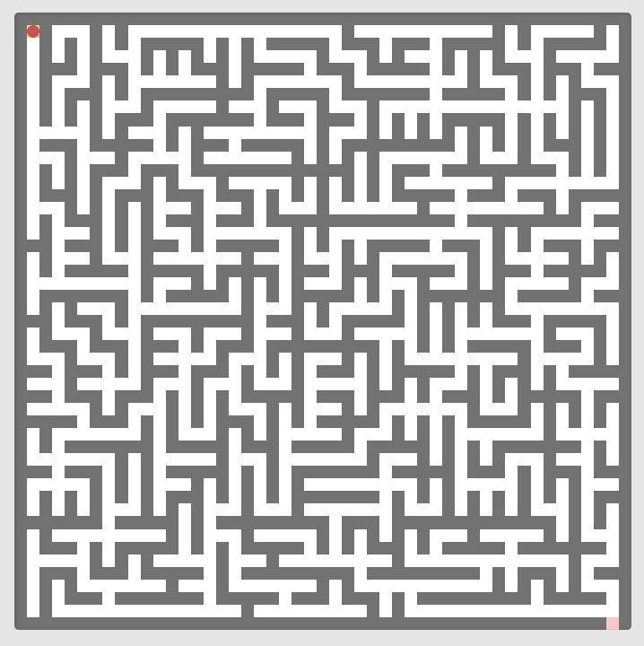

# [Play the game](https://themazerunner.vercel.app)

- [Click here](https://themazerunner.vercel.app/maze/10/play) to solve the maze yourself
- Or [click here](https://themazerunner.vercel.app/maze/10/dfs) to solve the maze automatically using depth-first search

# Project rundown

### Building a grid + movable player

My first challenge was figuring out how to create a grid that could be set to any arbitary size. I wanted to set this up so that the maze wouldn't actually get any bigger, rather the grid cells would get smaller to fit more in. I.e. a complex grid with 10,000 cells, would be the same size as a simple grid with 25 cells.

I then added a player component (the red dot), which could moved using the W,A,S,D or arrow keys, and used simple maths to stay aligned with the grid.

### Adding walls + goal

The next step was figuring out how to represent objects in the grid. I decided to have just two objects, walls, and a door, and each cell could either be of these objects, or be empty i.e path. These objects were placed into the maze by adding their coordinates to a dictionary / key-val object.

When the player moves, it checks against this dictionary to see if there is a wall blocking the move. And if there is a door, it sets a flag which triggers the "game won" state.

### Trying out maze generation algorithms

Maze generation turned out to be more complex anticipated. I spent some time researching different maze generation algorithms, weighing up their efficiency, implementation difficulty, and randomness.

In the end, I opted for the aldous-broder algorithm, as it was easy to implement and guaranteed a completely random maze selected from the set of all possible mazes.

However, I'm keen to explore and compare other maze generation algorithms in future, as the aldous-broder algorithm is notoriously inefficient.

It would also be cool to try visualising some of these maze generation algorithms.

### Storing visited cells

Next I added support for storing visited cells and displaying this on the maze, to avoid going down the same paths. This was also a precursor to being able to use depth-first search to solve the puzzle.

### Adding maze solver using DFS

The final step was implementing a recursive depth-first search to solve the puzzle.

I also added some pixel art styling at this stage, in the style of the maze runner book/movie series.

# Conclusion

This project was my first dive into the world of maze-generation and maze solving algorithms. I'm very pleased with the results of the project.

In future, I'd like to explore ways of improving the efficiency of the maze solver. While depth-first search lends itself well to solving mazes and is guaranteed to always find a solution, it is often inefficient, choosing paths that are unlikely to lead to the goal.

Using heuristics such as "straight line distance to the goal" to choose paths would greatly improve the efficiency of the algorithm.